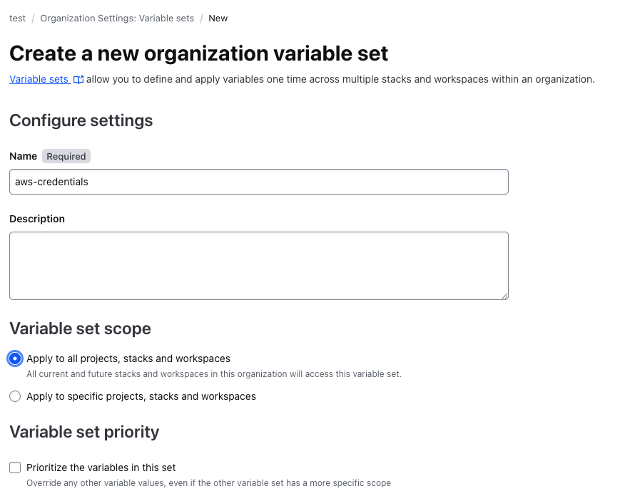
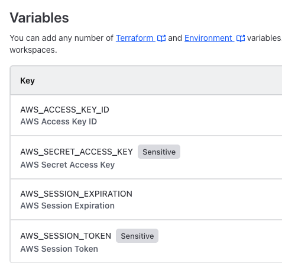
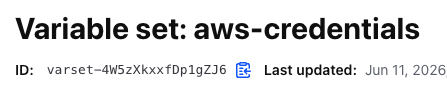
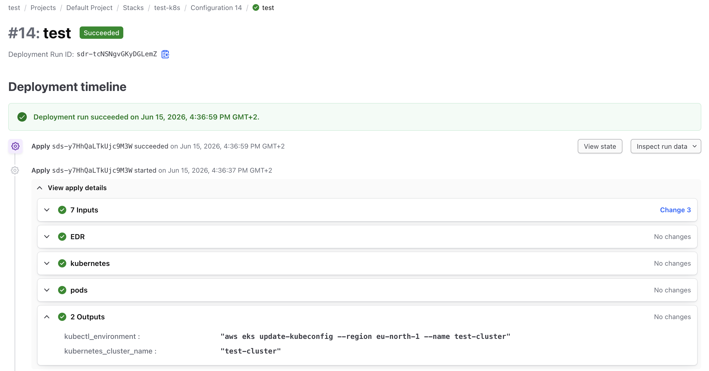

# Terraform Stacks CLI example AWS

This repository shows how to use Terraform Stacks with Terraform Enterprise and AWS to deploy a Kubernetes environment and supporting components.

The stack provisions Kubernetes resources, including an nginx Pod and a LoadBalancer Service on port 80, and includes additional folders for Kubernetes base resources and EDR-related deployments.


## Prerequisites

Before you can use this project, you need to have the following set up:

### 1. Terraform Enterprise
- Create or have access to an organization in Terraform Cloud/Terraform Enterprise
- Ensure you have permissions to create projects and stacks

### 2. Terraform Binary
Install the Terraform CLI on your local machine:

### 3. Local Repository Setup
Clone this repository to your local machine:
```bash
git clone https://github.com/munnep/terraform_stacks_aws_kubernetes_example.git
cd terraform_stacks_aws_kubernetes_example
```


### 5. Required Permissions
- Your Terraform user must have appropriate permissions in the organization
- The organization should have Terraform Stacks enabled (this may be in beta/preview)


## How to Use This Project

- Within Terraform Enterprise create a variable set where you will store your AWS credentials. Use the name `aws-credentials`
  
  
Store the Variable set name/ID. You will need it later  
  

- If using Terraform Enterprise set your hostname

```
export TF_STACKS_HOSTNAME=tfe1.munnep.com
```

- Initialize the Terraform Stacks configuration:
  ```bash
  terraform stacks init
  ```
  Expected output:
  ```
  Success! Configuration has been initialized and more commands can now be executed.
  ```


- Create a new stack in your Terraform organization:
  ```bash
  terraform stacks create -organization-name test -project-name "Default Project" -stack-name test-k8s
  ```

- Create provider lock files for multiple platforms to ensure consistent provider versions:
  ```bash
  terraform stacks providers-lock -platform=linux_amd64 -platform=darwin_amd64
  ```

- Upload your current stack configuration to Terraform Cloud:
  ```bash
  terraform stacks configuration upload -organization-name test -project-name "Default Project" -stack-name test-k8s
  ```

- Watch the configuration upload and processing status:
  ```bash
  terraform stacks configuration watch -organization-name test -project-name "Default Project" -stack-name test-k8s
  ```
  Example output:
  ```
  [Configuration Sequence Number: 1]                                                    
  ✓ Configuration: 'stc-m3SoAFnRYKzQ8nTC'                   [Completed]        [31s]  
    ✓ Deployment Group: 'test_default'                      [Succeeded]        [1m29s]

  ```

- Approve and Apply Plans
  Once the configuration is processed, approve the deployment plans for each environment:

  For test environment:
  ```bash
  terraform stacks deployment-group approve-all-plans -organization-name test -project-name "Default Project" -stack-name test-k8s -deployment-group-name test_default
  ```

- Result in Terraform Enterprise should look like the following   
  
- Destroy once you are done by alter the parameter `destroy = false ` in the `main.tfdeploy.hcl` file